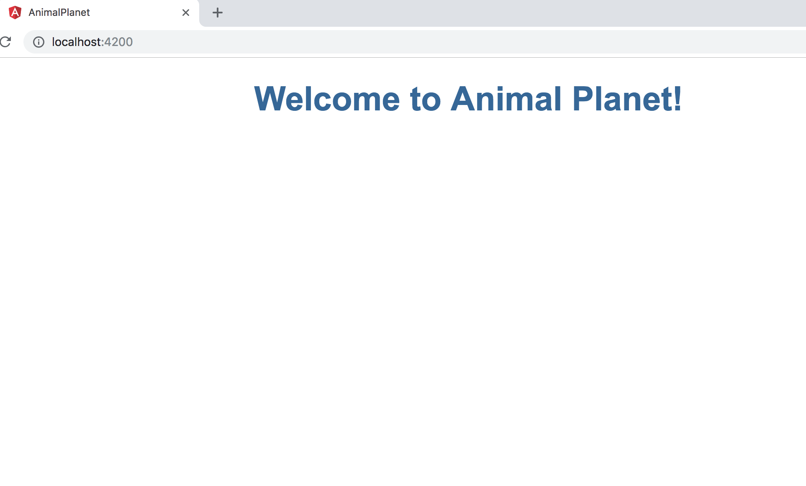

# 新專案
首先我們先建立一個新的app來做練習<br/>

```sh
$ ng new animal_planet
? Would you like to add Angular routing? Yes
? Which stylesheet format would you like to use? CSS
$ cd animal_planet
$ ng serve --open
```
`ng serve --open` 跟 `npm start`一樣都會開啟angular server

# Angular Componets
基本上Angular就是由各componets所組成,存放在`src/app`底下。<br/>
而因為app是根，所以會有以下六個檔案。<b/>

- `app-routing.module.ts`: 因為我們一開始設置有選擇要使用Angular Routing。
- `app.component.css`: 這個component自己的css樣式。
- `app.component.html`: 這個component的html template。
- `app.component.spec.ts`: 這個component的單位測試用的TypeScript code。
- `app.component.ts`: 這個component類別所用的TypeScript code。
- `app.module.ts`: 這個app module的設定。

# App Title
第一次練習，先來修改app的title。
首先開啟`app.component.ts`，找到`title`這個屬性把值修改成"Animal Planet"<br/>

```ts
import { Component } from '@angular/core';

@Component({
  selector: 'app-root',
  templateUrl: './app.component.html',
  styleUrls: ['./app.component.css']
})
export class AppComponent {
  title = 'Animal Planet';
}
```
從這裡我們還可以順便看到，其實這個component的tempalte(`app.component.html`)跟css(`app.component.css`,可多個)是在這裡做設定的，所以如果有需要用資料夾做統一管理的話，也可以經由這邊設定改變。
`selector`則是代表要用的tag，以這邊設定來說，用了`app-root`，在index.html寫入`<app-root></app-root>`就會載入這個主要的app component。

`export` 這邊就是傳給template，告訴他有個變數叫`title`，值是"Animal Planet"<br/>

接著我們開啟`app.component.html`修改成

```html
<div style="text-align:center">
  <h1>
    Welcome to {{ title }}!
  </h1>
</div>


<router-outlet></router-outlet>
```
`{{ title }}` 就是從`app.component.ts`所傳遞過來的變數`title`<br/>

接著還有`app.component.css`

```css
h1 {
  color: #369;
  font-family: Arial, Helvetica, sans-serif;
  font-size: 250%;
}
```
然後回到`http://localhost:4200/`，我們應該可以看到畫面變成
<<<<<<< Updated upstream

=======

>>>>>>> Stashed changes


