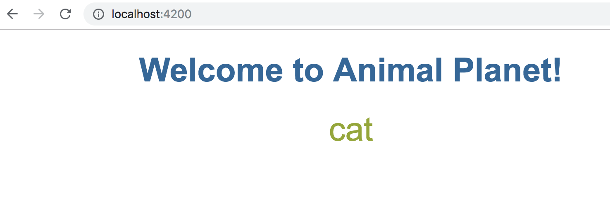
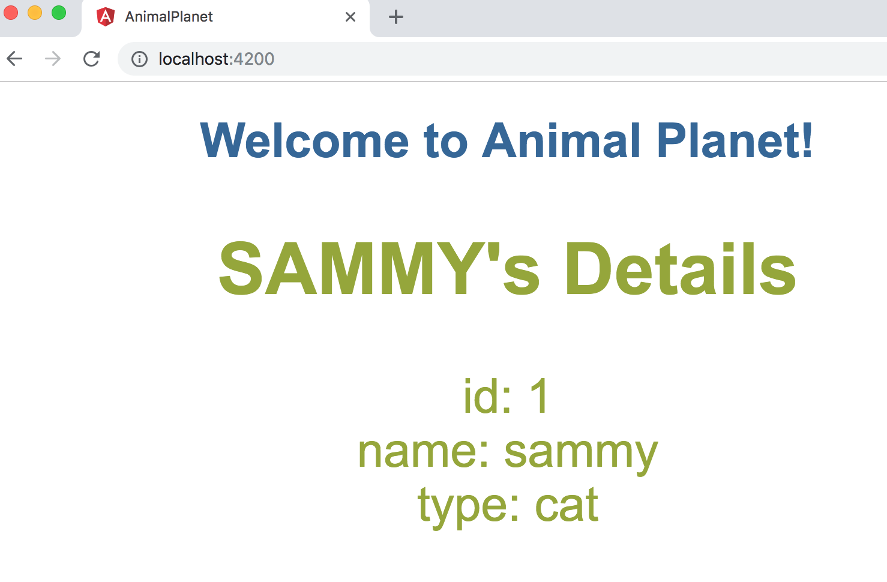

# The Animal
第二個練習我們要建立新的component來顯示動物的資料<br/>

```sh
$ ng generate component animals
CREATE src/app/animals/animals.component.css (0 bytes)
CREATE src/app/animals/animals.component.html (26 bytes)
CREATE src/app/animals/animals.component.spec.ts (635 bytes)
CREATE src/app/animals/animals.component.ts (273 bytes)
UPDATE src/app/app.module.ts (479 bytes)
```
`ng g c animals` 縮寫指令有一樣的效果。這邊會看到它自動幫你把animals component相關的檔案都建置起來，也將`app.module.ts`更新了，import自動加上`import { AnimalsComponent } from './animals/animals.component';`及declarations宣告多了`AnimalsComponent`

# 來隻貓吧

首先我們在`animals.component.ts` export的部分加上`animal = 'Cat'`

```ts
import { Component, OnInit } from '@angular/core';

@Component({
  selector: 'app-animals',
  templateUrl: './animals.component.html',
  styleUrls: ['./animals.component.css']
})
export class AnimalsComponent implements OnInit {

  animal = 'cat';
  constructor() { }

  ngOnInit() {
  }

}
```

再來將`animals.component.html`秀出變數`animal`

```html
<div class="animals"> {{ animal }} </div>
```

`animals.component.css`給他一點顏色

```css
.animals {
  color: rgb(149, 167, 49);
  font-family: Arial, Helvetica, sans-serif;
  font-size: 250%;
}
```

接著我們再回到`app.component.html`將`<app-animals></app-animals>`添加在喜歡的地方

```html
<div style="text-align:center">
  <h1>
    Welcome to {{ title }}!
  </h1>

  <app-animals></app-animals>
</div>


<router-outlet></router-outlet>
```
登勒～我們就會看到畫面變成


# 建立動物類別
動物有很多種啊!!所以我們先在`src/app/`底下建立一個動物類別`animal.ts`

```ts
export class Animal {
  id: number;
  name: string;
  type: string;
}
```
接著我們回到`animals.component.ts`將這個類別import進來,

```ts
import { Component, OnInit } from '@angular/core';
import { Animal } from '../animal';

@Component({
  selector: 'app-animals',
  templateUrl: './animals.component.html',
  styleUrls: ['./animals.component.css']
})
export class AnimalsComponent implements OnInit {

  animal: Animal = {
    id: 1,
    name: 'sammy',
    type: 'cat'
  };
  constructor() { }

  ngOnInit() {
  }

}
```

因為我們已經將animal這個變數改成Animal的類別，所以`animals.component.html` template的部分也要稍作修改。

```html
<div class="animals">
  <h2> {{ animal.name| uppercase}}'s Details</h2>
  <div><span>id: </span>{{animal.id}}</div>
  <div><span>name: </span>{{animal.name}}</div>
  <div><span>type: </span>{{animal.type}}</div>
</div>
```
這樣我們應該可以看到畫面變成



