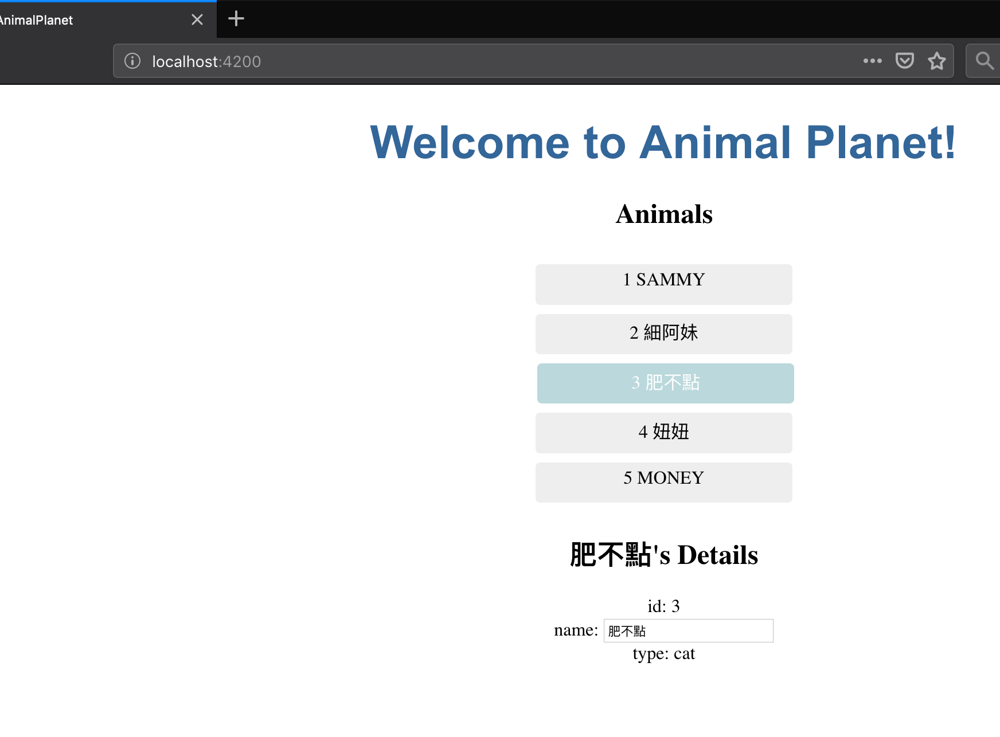
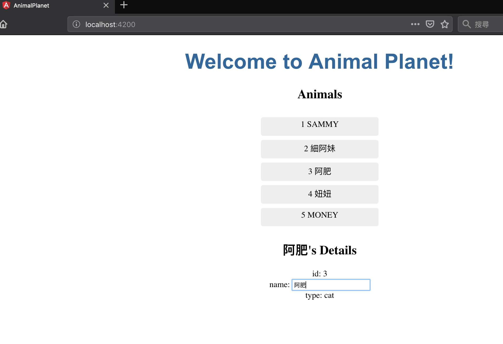

# The Animal
第三個練習我們要建立detail component, 將動物的詳細資料放到裡面<br/>

```sh
$ ng g c animal-detail
```
首先我們在`animal-detail.component.ts` 多import animal類別
跟export部分加上一個傳入的變數(因為是從另外一個component onclick傳入）

```ts
import { Component, OnInit, Input } from '@angular/core';
import { Animal } from '../animal';

@Component({
  selector: 'app-animal-detail',
  templateUrl: './animal-detail.component.html',
  styleUrls: ['./animal-detail.component.css']
})
export class AnimalDetailComponent implements OnInit {

  @Input() animal: Animal;

  constructor() { }

  ngOnInit() {
  }

}
```

接著我們將上次練習的onclick顯示的部分移到`animal-detail.component.html`內，因為我們在傳入的變數命名改為animal了，所以
html的部份我們也跟著做修改

```html
<div *ngIf="animal">
  <h2> {{ animal.name | uppercase}}'s Details</h2>
  <div><span>id: </span>{{animal.id}}</div>
  <div><span>name: </span>{{animal.name}}</div>
  <div><span>type: </span>{{animal.type }}</div>
</div>
```
再來我們在原本`animals.component.html`原本動物詳細資料的部分改為呼叫這個component

```html
<h2> Animals</h2>
<ul class="animals">
  <li *ngFor="let animal of animals"
      [class.selected]="animal === selectedAnimal"
      (click)="onSelect(animal)">
    <span >{{animal.id}}</span> {{animal.name | uppercase}}
  </li>
</ul>
<app-animal-detail [animal]="selectedAnimal"></app-animal-detail>

```
畫面呈現上沒有變，但這樣animal-detail.component就可以重複使用了

# 資料繫結
## 資料繫結的方式  

- 內嵌繫結(Interpolation):  
之前的練習用的`{{xxx}}`這種是屬於內嵌繫結。

- 屬性繫結(Property Binding):  
可以將DOM的attr 跟Angular的變數做繫結，方式是將DOM的attr用[]包起來，等號後面是要繫結的Angular變數。例如
`<input name='input1' [placeholder]='input_hint'/>`
這個輸入格的提示就不會出現"input_hint"，而是呈現component.ts內的`input_hint`值。

- 事件繫結(Event Binding):  
之前練習的click就是屬於事件繫結。事件繫結有兩種做法，一種是中間加"-"來表示，如`<li on-click="event">abc</li>`，另外一種則是之前練習用的加上()小括號來表示`<li (click)="event">abc</li>`。

- 雙向繫結(Two-way Binding):   
可在template跟ts之間做雙向資料繫結，如:
`<input name='input1' [(ng-model)]="object.name"/>`
這樣input內的值就會是ts內`object.name`，而變動input值的同時也會將變動套用到ts內`object.name`上。這個`app.modules.ts`裡面也要`import FormsModule`才能正常運作

## 練習

`app.module.ts`

```ts
import { BrowserModule } from '@angular/platform-browser';
import { NgModule } from '@angular/core';
import { FormsModule } from '@angular/forms';

import { AppRoutingModule } from './app-routing.module';
import { AppComponent } from './app.component';
import { AnimalsComponent } from './animals/animals.component';
import { AnimalDetailComponent } from './animal-detail/animal-detail.component';

@NgModule({
  declarations: [
    AppComponent,
    AnimalsComponent,
    AnimalDetailComponent
  ],
  imports: [
    BrowserModule,
    AppRoutingModule,
    FormsModule,
  ],
  providers: [],
  bootstrap: [AppComponent]
})
export class AppModule { }
```

`animals.component.html`

```html
<h2> Animals</h2>
<ul class="animals">
  <li *ngFor="let animal of animals"
      [class.selected]="animal === selectedAnimal"
      (click)="onSelect(animal)">
    <span >{{animal.id}}</span> {{animal.name | uppercase}}
  </li>
</ul>
<app-animal-detail [animal]="selectedAnimal"></app-animal-detail>
```
`animal-detail.component.html`

```html
<div *ngIf="animal">
  <h2 [title]="animal.name | uppercase"> {{ animal.name | uppercase}}'s Details</h2>
  <div><span>id: </span>{{animal.id}}</div>
  <div><span>name: </span> <input [(ngModel)]="animal.name" /></div>
  <div><span>type: </span>{{animal.type }}</div>
</div>

```

<br/>

詳細內容的輸入框，修改名字後列表的名字也跟著變了。



# 總結
在這次練習我們會知道

- 主/從Comment的使用
- 資料繫結的方式

